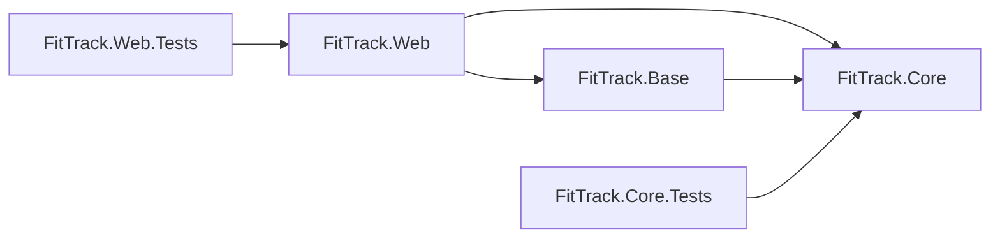
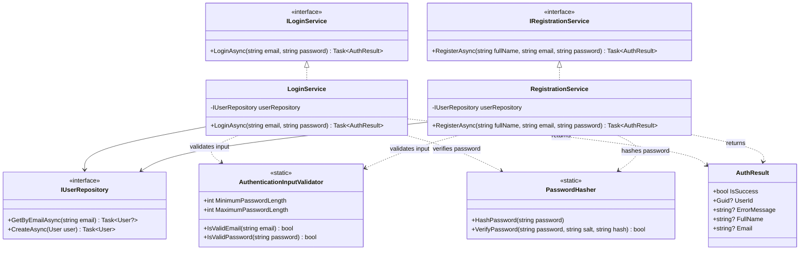
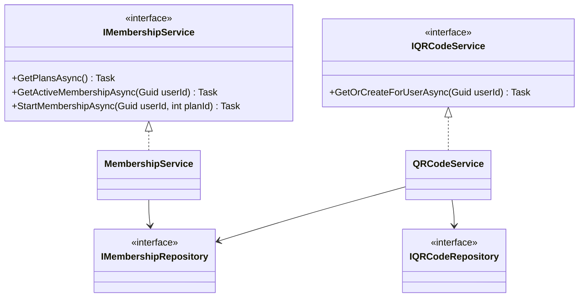
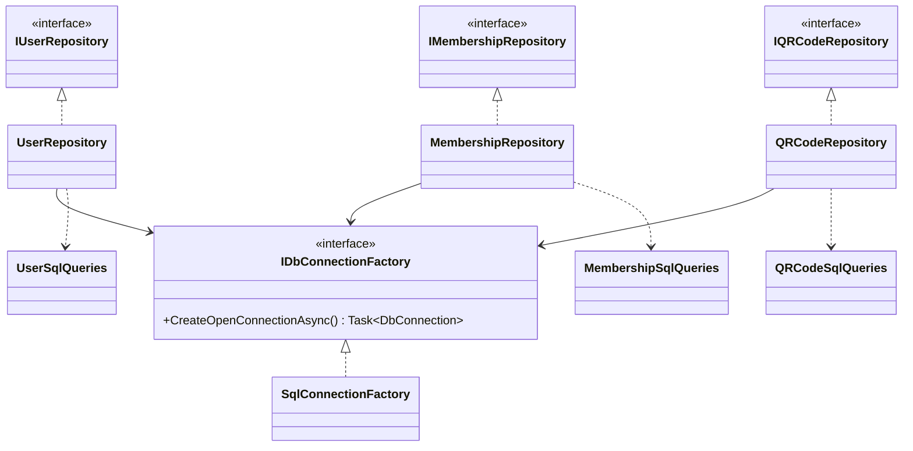
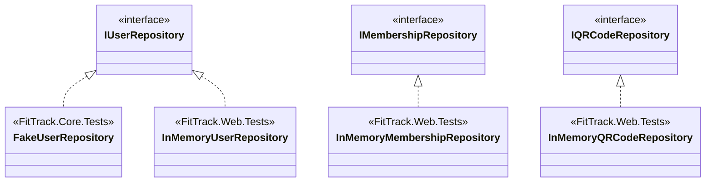
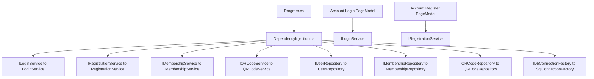
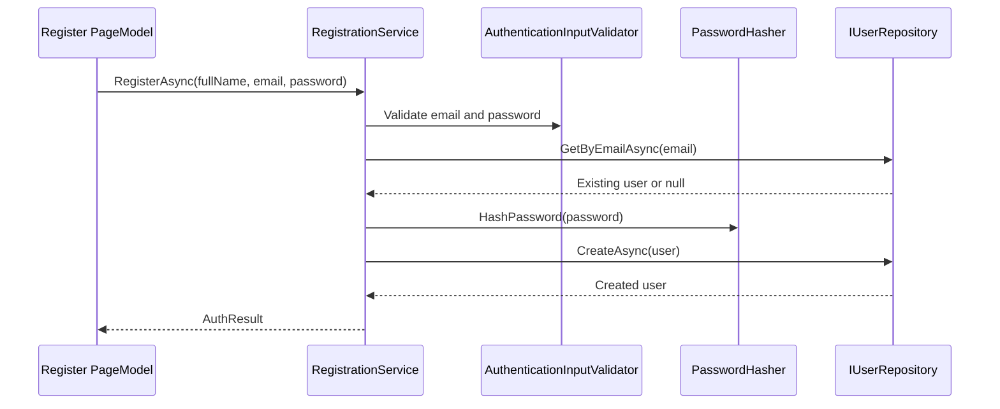
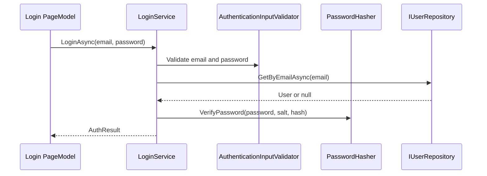

# FitTrack Current Structure

This document describes the current solution structure and the main class
relationships used by the application and its tests.

## Solution Overview

```text
FitTrack
|-- src
|   |-- FitTrack.Core
|   |-- FitTrack.Base
|   `-- FitTrack.Web
`-- tests
    |-- FitTrack.Core.Tests
    `-- FitTrack.Web.Tests
```

| Project | Responsibility |
| --- | --- |
| `FitTrack.Core` | Entities, DTOs, results, interfaces, validation, and business services. |
| `FitTrack.Base` | SQL Server connection, query definitions, and production repository implementations. |
| `FitTrack.Web` | Razor Pages, input models, authentication, configuration, and dependency injection. |
| `FitTrack.Core.Tests` | Unit tests with a `FakeUserRepository`. |
| `FitTrack.Web.Tests` | Web integration tests with in-memory repository implementations. |

## Project Dependencies



`FitTrack.Core` has no project references. Production repository
implementations belong to `FitTrack.Base`; fake and in-memory repositories
belong to the test projects.

## Current Source Tree

```text
src
|-- FitTrack.Core
|   |-- Dtos
|   |   |-- MembershipDto.cs
|   |   |-- MembershipPlanDto.cs
|   |   |-- QRCodeDto.cs
|   |   `-- UserDto.cs
|   |-- Entities
|   |   |-- Membership.cs
|   |   |-- MembershipPlan.cs
|   |   |-- QRCode.cs
|   |   `-- User.cs
|   |-- Interfaces
|   |   |-- Data
|   |   |   `-- IDbConnectionFactory.cs
|   |   |-- Repositories
|   |   |   |-- IMembershipRepository.cs
|   |   |   |-- IQRCodeRepository.cs
|   |   |   `-- IUserRepository.cs
|   |   `-- Services
|   |       |-- ILoginService.cs
|   |       |-- IMembershipService.cs
|   |       |-- IQRCodeService.cs
|   |       `-- IRegistrationService.cs
|   |-- Results
|   |   `-- AuthResult.cs
|   `-- Services
|       |-- AuthenticationInputValidator.cs
|       |-- LoginService.cs
|       |-- MembershipService.cs
|       |-- PasswordHasher.cs
|       |-- QRCodeService.cs
|       `-- RegistrationService.cs
|-- FitTrack.Base
|   |-- Data
|   |   `-- SqlConnectionFactory.cs
|   |-- Queries
|   |   |-- MembershipSqlQueries.cs
|   |   |-- QRCodeSqlQueries.cs
|   |   `-- UserSqlQueries.cs
|   `-- Repositories
|       |-- MembershipRepository.cs
|       |-- QRCodeRepository.cs
|       `-- UserRepository.cs
`-- FitTrack.Web
    |-- Configuration
    |   `-- DependencyInjection.cs
    |-- Pages
    |   |-- Account
    |   |-- Dashboard
    |   `-- Memberships
    |-- ViewModels
    |   `-- Account
    |       |-- LoginInputModel.cs
    |       `-- RegisterInputModel.cs
    `-- Program.cs

tests
|-- FitTrack.Core.Tests
|   |-- Entities
|   |-- Fakes
|   |   `-- FakeUserRepository.cs
|   `-- Services
|       |-- LoginServiceTests.cs
|       `-- RegistrationServiceTests.cs
`-- FitTrack.Web.Tests
    |-- Fakes
    |   |-- InMemoryMembershipRepository.cs
    |   |-- InMemoryQRCodeRepository.cs
    |   `-- InMemoryUserRepository.cs
    |-- FitTrackWebApplicationFactory.cs
    `-- FitTrackWebTests.cs
```

## Authentication Classes

There is no combined `AuthService`. Login and registration have separate
interfaces and services. They share static validation and password-hashing
helpers.



`AuthenticationInputValidator` and `PasswordHasher` are internal static helper
classes. They are not injected services and do not need interfaces.

## Core Services



## Production Repositories



The production repositories use SQL Server through `SqlConnectionFactory`.
They are the only repository implementations under `src`.

## Test Repositories

Test doubles are kept under `tests`, so they are not shipped as production
infrastructure.



- `FakeUserRepository` supports focused Core unit tests.
- The three `InMemory...Repository` classes replace SQL repositories during
  web integration tests.
- `FitTrackWebApplicationFactory` performs those test-only dependency
  injection replacements.

## Web And Dependency Injection



| Service | Production implementation | Lifetime |
| --- | --- | --- |
| `IDbConnectionFactory` | `SqlConnectionFactory` | Singleton |
| `IUserRepository` | `UserRepository` | Scoped |
| `IMembershipRepository` | `MembershipRepository` | Scoped |
| `IQRCodeRepository` | `QRCodeRepository` | Scoped |
| `ILoginService` | `LoginService` | Scoped |
| `IRegistrationService` | `RegistrationService` | Scoped |
| `IMembershipService` | `MembershipService` | Scoped |
| `IQRCodeService` | `QRCodeService` | Scoped |

## Registration Flow



## Login Flow


