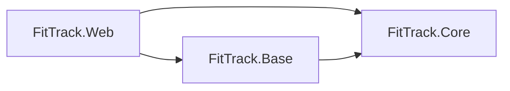
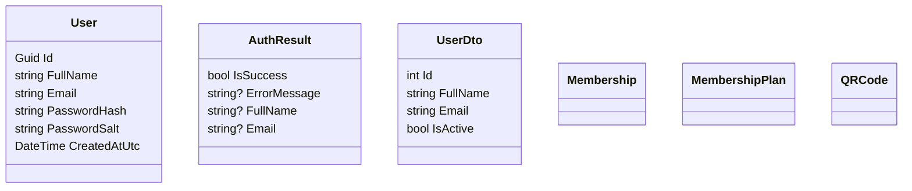
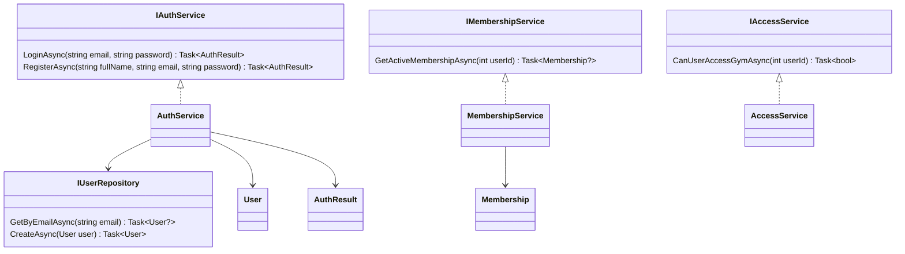
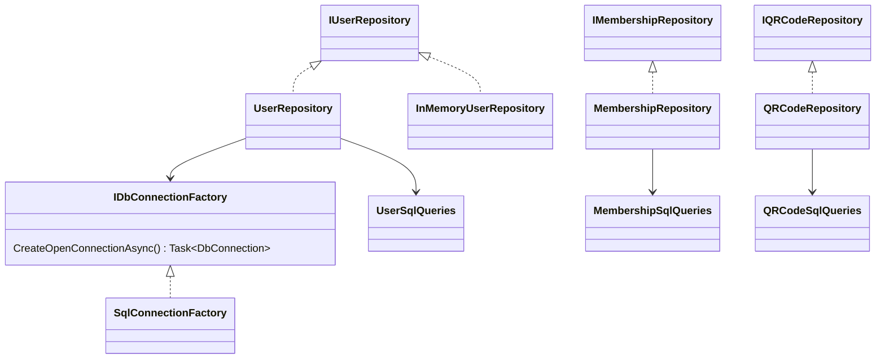
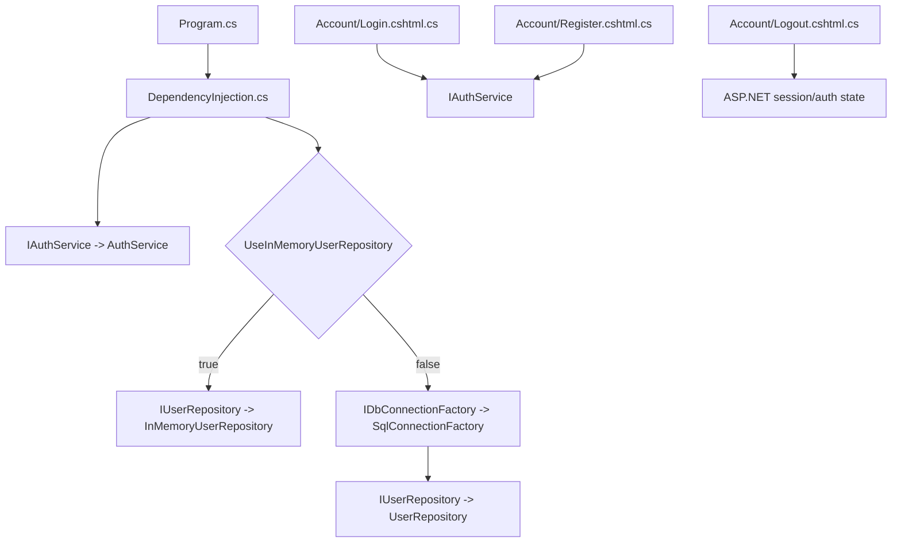
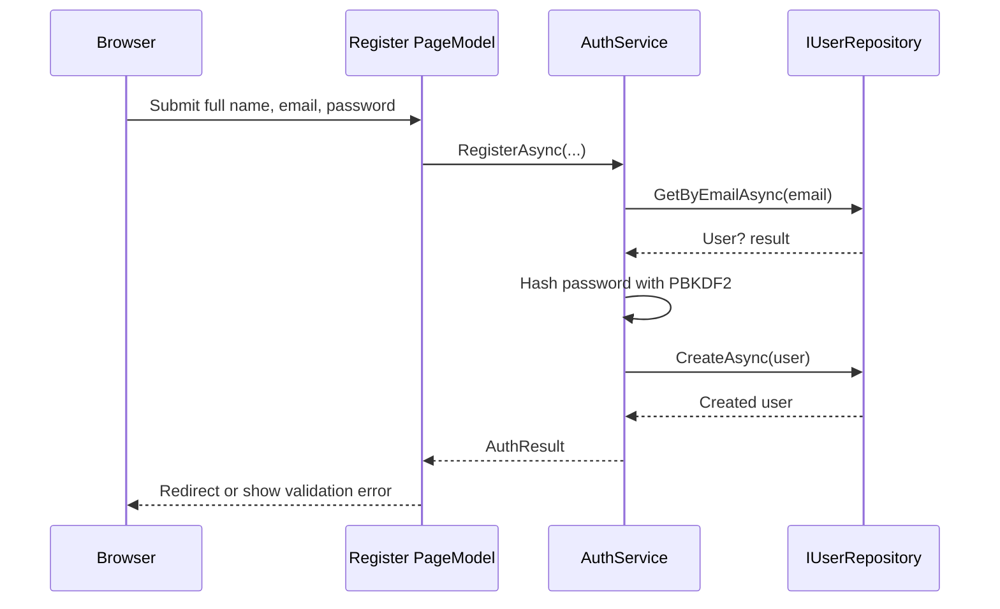
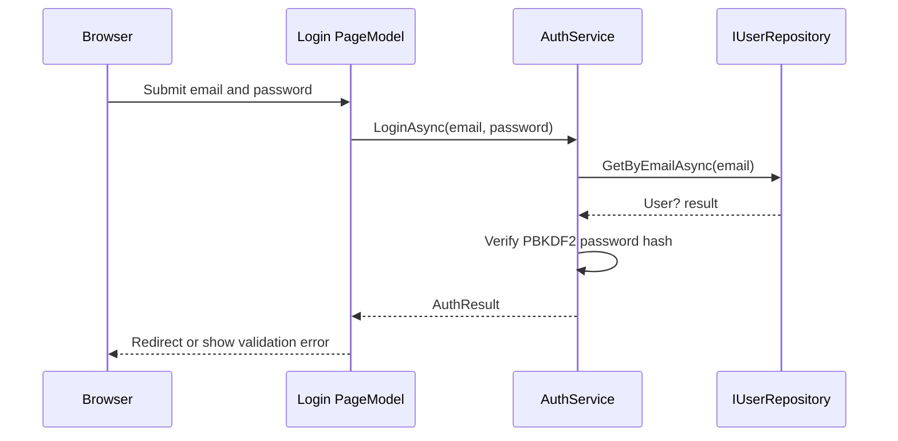

# FitTrack Current Structure

This document captures the current project structure for architecture and class diagrams.

## Solution Overview

```text
FitTrack
|-- FitTrack.slnx
|-- Directory.Build.props
|-- docs
|   `-- current-structure.md
`-- src
    |-- FitTrack.Core
    |-- FitTrack.Base
    `-- FitTrack.Web
```

## Project Responsibilities

| Project | Responsibility |
| --- | --- |
| `FitTrack.Core` | Domain entities, repository/service contracts, and core business services. |
| `FitTrack.Base` | Infrastructure implementations such as SQL access, SQL query text, and repositories. |
| `FitTrack.Web` | ASP.NET Core Razor Pages UI, dependency injection setup, configuration, and static assets. |

## Project Dependencies



`FitTrack.Core` is the innermost project and has no project references. `FitTrack.Base` depends on `FitTrack.Core` to implement its interfaces. `FitTrack.Web` references both projects so it can register implementations and use core services.

## Source Tree

```text
src
|-- FitTrack.Core
|   |-- Entities
|   |   |-- AuthResult.cs
|   |   |-- Membership.cs
|   |   |-- MembershipPlan.cs
|   |   |-- QRCode.cs
|   |   |-- User.cs
|   |   `-- UserDto.cs
|   |-- Interfaces
|   |   |-- Data
|   |   |   `-- IDbConnectionFactory.cs
|   |   |-- Repositories
|   |   |   |-- IMembershipRepository.cs
|   |   |   |-- IQRCodeRepository.cs
|   |   |   `-- IUserRepository.cs
|   |   `-- Services
|   |       |-- IAccessService.cs
|   |       |-- IAuthService.cs
|   |       `-- IMembershipService.cs
|   `-- Services
|       |-- AccessService.cs
|       |-- AuthService.cs
|       `-- MembershipService.cs
|-- FitTrack.Base
|   |-- Data
|   |   `-- SqlConnectionFactory.cs
|   |-- Queries
|   |   |-- MembershipSqlQueries.cs
|   |   |-- QRCodeSqlQueries.cs
|   |   `-- UserSqlQueries.cs
|   `-- Repositories
|       |-- InMemoryUserRepository.cs
|       |-- MembershipRepository.cs
|       |-- QRCodeRepository.cs
|       `-- UserRepository.cs
`-- FitTrack.Web
    |-- Configuration
    |   `-- DependencyInjection.cs
    |-- Pages
    |   |-- Account
    |   |   |-- Login.cshtml
    |   |   |-- Login.cshtml.cs
    |   |   |-- Logout.cshtml
    |   |   |-- Logout.cshtml.cs
    |   |   |-- Register.cshtml
    |   |   `-- Register.cshtml.cs
    |   |-- Shared
    |   |   |-- _Layout.cshtml
    |   |   `-- _ValidationScriptsPartial.cshtml
    |   |-- Error.cshtml
    |   |-- Error.cshtml.cs
    |   |-- Index.cshtml
    |   |-- Index.cshtml.cs
    |   |-- _ViewImports.cshtml
    |   `-- _ViewStart.cshtml
    |-- Properties
    |   `-- launchSettings.json
    |-- ViewModels
    |   `-- Account
    |       |-- LoginInputModel.cs
    |       `-- RegisterInputModel.cs
    |-- wwwroot
    |   |-- css
    |   |   `-- site.css
    |   |-- img
    |   |   `-- auth-graffiti-gym.png
    |   |-- js
    |   |   `-- site.js
    |   `-- favicon.ico
    |-- Program.cs
    |-- appsettings.Development.json
    `-- appsettings.json
```

## Core Layer

### Entities

| Entity | Current purpose |
| --- | --- |
| `User` | Account entity with `Id`, `FullName`, `Email`, password hash/salt, and creation timestamp. |
| `AuthResult` | Authentication operation result returned from login and registration. |
| `UserDto` | Lightweight user data transfer shape. |
| `Membership` | Placeholder entity for membership data. |
| `MembershipPlan` | Placeholder entity for membership plan data. |
| `QRCode` | Placeholder entity for QR code access data. |



### Interfaces And Services



## Infrastructure Layer



## Web Layer



## Current Runtime Flow

### Register



### Login



## Dependency Injection Registrations

| Condition | Service | Implementation | Lifetime |
| --- | --- | --- | --- |
| `UseInMemoryUserRepository = true` | `IUserRepository` | `InMemoryUserRepository` | Singleton |
| Always in in-memory mode | `IAuthService` | `AuthService` | Scoped |
| `UseInMemoryUserRepository = false` | `IDbConnectionFactory` | `SqlConnectionFactory` | Singleton |
| `UseInMemoryUserRepository = false` | `IUserRepository` | `UserRepository` | Scoped |
| Always in SQL mode | `IAuthService` | `AuthService` | Scoped |

## Notes For Diagrams

- The `Models` folder has been removed from `FitTrack.Core`; `AuthResult` and `UserDto` now live with the other core entities under `FitTrack.Core.Entities`.
- `Membership`, `MembershipPlan`, and `QRCode` are currently empty placeholder entities.
- `MembershipRepository`, `QRCodeRepository`, `AccessService`, and `MembershipService` currently throw `NotImplementedException`.
- `UserRepository` is the current SQL-backed implementation of `IUserRepository`.
- `InMemoryUserRepository` is available for development/testing when configured through `UseInMemoryUserRepository`.
