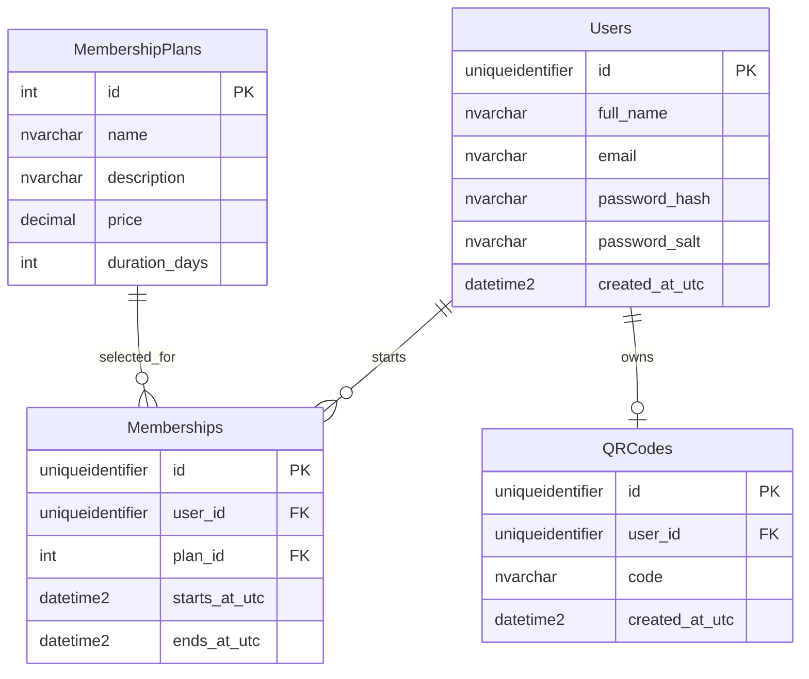

# FitTrack Database Design

## Purpose

This document explains how the FitTrack database was designed, why it was designed this way, how the application communicates with it, and which SQL queries are used.

FitTrack uses Microsoft SQL Server through `Microsoft.Data.SqlClient`. The application uses repositories and manually written parameterized SQL instead of an Object-Relational Mapper such as Entity Framework Core.

## Database Responsibilities

The database stores:

- User accounts and protected password data.
- Available membership plans.
- Memberships started by users.
- One personal QR-code value per user.

The database is not accessed directly from Razor Pages or Core services. SQL access belongs to the `FitTrack.Base` layer:

```text
Razor Page
    -> Core service interface
    -> Core service
    -> Repository interface
    -> SQL repository in FitTrack.Base
    -> SQL Server
```

The SQL database was created so account, membership, and QR-code data remains available after the application stops or restarts. FitTrack also has in-memory repository implementations, but those store data only while the application process is running. They are useful for development and testing, while SQL Server is used for persistent application data.

## Table Model

The application uses these tables inside the `fittrack` SQL schema:



The current source contains automatic schema creation for `MembershipPlans`, `Memberships`, and `QRCodes`. The `Users` table is expected to already exist in the connected database because `UserSqlQueries` currently contains only read and insert queries.

## Why A Separate SQL Schema Is Used

The tables use the `fittrack` schema instead of the default `dbo` schema:

```sql
IF NOT EXISTS (SELECT 1 FROM sys.schemas WHERE name = 'fittrack')
BEGIN
    EXEC('CREATE SCHEMA fittrack');
END;
```

Reasons:

- It groups all FitTrack tables together.
- It avoids naming conflicts with tables from other applications.
- It makes ownership and purpose clearer in a shared school database.

## Why The Tables Are Separated

### Users And Memberships

A user account and a membership are different concepts:

```text
User
    -> Identity, email, password data

Membership
    -> A user's selected plan and active dates
```

A user can exist without a membership. Keeping them separate avoids adding nullable membership columns to every user.

### Membership Plans And Memberships

`MembershipPlans` stores reusable offers:

```text
Weekly  -> 7 days
Monthly -> 30 days
Yearly  -> 365 days
```

`Memberships` stores an individual user's selected plan and dates.

This avoids repeating plan price, description, and duration for every user. It also allows the same plan to be selected by many users.

### QR Codes

QR codes are stored separately because they are created only after a user has an active membership. The unique constraint on `user_id` ensures that one user has at most one QR-code record:

```sql
CONSTRAINT UQ_QRCodes_UserId UNIQUE (user_id)
```

The unique constraint on `code` ensures two users cannot receive the same QR-code value:

```sql
CONSTRAINT UQ_QRCodes_Code UNIQUE (code)
```

## Key Choices

### `uniqueidentifier` For Entity IDs

Users, memberships, and QR codes use `uniqueidentifier`, which maps to C# `Guid`.

Example:

```csharp
Guid.NewGuid()
```

Reasons:

- IDs can be generated safely inside the application before insertion.
- IDs are unlikely to collide.
- IDs are harder to guess than sequential integers.
- The same ID type is used across the main entities.

Membership plans use small integer IDs because the plans are predefined and easy to reference.

### UTC Dates

Date columns use names such as:

```text
created_at_utc
starts_at_utc
ends_at_utc
```

The application stores UTC dates so comparisons do not depend on the server or user's local timezone.

The active membership query uses:

```sql
memberships.starts_at_utc <= SYSUTCDATETIME()
AND memberships.ends_at_utc > SYSUTCDATETIME()
```

### Password Hash And Salt

The database stores:

```text
password_hash
password_salt
```

It does not store the original password. `RegistrationService` hashes the password using PBKDF2 before the user reaches the repository.

### Foreign Keys

Foreign keys ensure related records refer to existing data:

```sql
FOREIGN KEY (user_id) REFERENCES fittrack.Users(id)
```

```sql
FOREIGN KEY (plan_id) REFERENCES fittrack.MembershipPlans(id)
```

This prevents a membership from referencing a user or plan that does not exist.

## Why Manually Written SQL Was Used

FitTrack uses manually written SQL queries stored in dedicated query classes:

```text
UserSqlQueries
MembershipSqlQueries
QRCodeSqlQueries
```

Repositories execute those queries using `Microsoft.Data.SqlClient`.

Example:

```csharp
command.CommandText = MembershipSqlQueries.GetActiveByUserId;
command.Parameters.Add(new SqlParameter("@UserId", userId));
```

Reasons for this approach:

- The executed SQL is visible and explicit.
- It demonstrates SQL knowledge.
- No ORM configuration or migrations are required.
- Repositories have full control over mapping database rows to entities.
- It is suitable for the small number of tables and queries in this project.

## Alternative Database Approaches

### Entity Framework Core

Entity Framework Core could map C# classes to tables and generate queries.

Advantages:

- Less manual mapping code.
- Built-in migrations.
- LINQ queries.
- Easier management for larger data models.

Disadvantages for this project:

- Adds another abstraction to learn.
- Generated SQL is less visible.
- More setup than required for the small database.

### Stored Procedures

Stored procedures could move SQL logic into SQL Server.

Advantages:

- SQL logic can be managed in the database.
- Permissions can be restricted to procedures.
- Useful for complex or shared database operations.

Disadvantages for this project:

- Application and database scripts must be deployed together.
- Logic is split across two environments.
- More difficult to inspect from the C# solution.

### SQL Inside Repository Methods

SQL strings could be written directly inside repository methods.

This is simple, but separating queries into query classes keeps repository methods easier to read and gives SQL statements one clear location.

### Reflection On The Choice

Manually written parameterized SQL is appropriate for FitTrack because the database is small and the project needs to demonstrate how SQL and repositories work. For a larger production application with many tables and migrations, Entity Framework Core could reduce repetitive code.

## Connection Factory

Repositories receive `IDbConnectionFactory`:

```csharp
public interface IDbConnectionFactory
{
    Task<DbConnection> CreateOpenConnectionAsync();
}
```

The SQL implementation opens a connection:

```csharp
public async Task<DbConnection> CreateOpenConnectionAsync()
{
    var connection = new SqlConnection(_connectionString);
    await connection.OpenAsync();
    return connection;
}
```

Repositories do not construct connection strings themselves. The connection string is supplied through configuration and dependency injection.

## Repository Mapping And Encapsulation

When a repository reads a database row, it reconstructs an entity through `Restore`:

```csharp
return Membership.Restore(
    reader.GetGuid(reader.GetOrdinal("id")),
    reader.GetGuid(reader.GetOrdinal("user_id")),
    reader.GetInt32(reader.GetOrdinal("plan_id")),
    reader.GetString(reader.GetOrdinal("plan_name")),
    reader.GetDateTime(reader.GetOrdinal("starts_at_utc")),
    reader.GetDateTime(reader.GetOrdinal("ends_at_utc")));
```

`Restore` keeps the existing ID and timestamps but still validates the values through the entity's private constructor.

When saving, the repository only reads the entity's public getters:

```csharp
command.Parameters.Add(new SqlParameter("@Id", membership.Id));
command.Parameters.Add(new SqlParameter("@UserId", membership.UserId));
command.Parameters.Add(new SqlParameter("@PlanId", membership.PlanId));
```

The repository cannot change the entity because its setters are private.

## Parameterized Queries

User-provided or application-provided values are passed as parameters:

```csharp
command.Parameters.Add(new SqlParameter("@Email", email.Trim()));
```

The SQL query contains the parameter name:

```sql
WHERE email = @Email;
```

This is better than building SQL with string concatenation:

```csharp
// Unsafe and not used:
command.CommandText = $"SELECT * FROM Users WHERE email = '{email}'";
```

Parameterized queries help prevent SQL injection and correctly handle data types.

## Schema Initialization

`MembershipRepository` and `QRCodeRepository` call `EnsureSchemaAsync()` before using their tables.

The method:

- Creates the `fittrack` schema if needed.
- Creates missing tables.
- Seeds or updates membership plans.
- Uses a `SemaphoreSlim` so multiple requests do not initialize the schema at the same time.
- Uses a static `_schemaEnsured` flag so initialization normally runs once per application process.

This approach makes the project easier to run because the membership and QR-code tables can initialize automatically.

For a larger production application, versioned database migrations would be a better option because they record and apply database changes in a controlled order.

## SQL Queries

### User: Find By Email

Purpose: load a user during login or check whether an email already exists during registration.

```sql
SELECT
    id,
    full_name,
    email,
    password_hash,
    password_salt,
    created_at_utc
FROM fittrack.Users
WHERE email = @Email;
```

### User: Create

Purpose: insert a new registered user.

```sql
INSERT INTO fittrack.Users (
    id,
    full_name,
    email,
    password_hash,
    password_salt,
    created_at_utc
)
VALUES (
    @Id,
    @FullName,
    @Email,
    @PasswordHash,
    @PasswordSalt,
    @CreatedAtUtc
);
```

### Membership Schema And Seed Data

Purpose: create membership tables and ensure the predefined plans exist.

```sql
IF NOT EXISTS (SELECT 1 FROM sys.schemas WHERE name = 'fittrack')
BEGIN
    EXEC('CREATE SCHEMA fittrack');
END;

IF OBJECT_ID('fittrack.MembershipPlans', 'U') IS NULL
BEGIN
    CREATE TABLE fittrack.MembershipPlans
    (
        id int NOT NULL PRIMARY KEY,
        name nvarchar(100) NOT NULL,
        description nvarchar(500) NOT NULL,
        price decimal(10, 2) NOT NULL,
        duration_days int NOT NULL
    );
END;

IF OBJECT_ID('fittrack.Memberships', 'U') IS NULL
BEGIN
    CREATE TABLE fittrack.Memberships
    (
        id uniqueidentifier NOT NULL PRIMARY KEY,
        user_id uniqueidentifier NOT NULL,
        plan_id int NOT NULL,
        starts_at_utc datetime2 NOT NULL,
        ends_at_utc datetime2 NOT NULL,
        CONSTRAINT FK_Memberships_Users
            FOREIGN KEY (user_id) REFERENCES fittrack.Users(id),
        CONSTRAINT FK_Memberships_MembershipPlans
            FOREIGN KEY (plan_id) REFERENCES fittrack.MembershipPlans(id)
    );
END;

MERGE fittrack.MembershipPlans AS target
USING
(
    VALUES
        (1, 'Weekly', 'Seven days of gym floor access with standard member check-in.', 9.99, 7),
        (2, 'Monthly', 'Thirty days of gym floor access, group classes, and conditioning sessions.', 29.99, 30),
        (3, 'Yearly', 'A full year of gym access, classes, recovery area, and priority booking.', 299.99, 365)
) AS source (id, name, description, price, duration_days)
ON target.id = source.id
WHEN MATCHED THEN
    UPDATE SET
        name = source.name,
        description = source.description,
        price = source.price,
        duration_days = source.duration_days
WHEN NOT MATCHED THEN
    INSERT (id, name, description, price, duration_days)
    VALUES (source.id, source.name, source.description, source.price, source.duration_days);
```

`MERGE` is used so running the initialization more than once does not create duplicate plans. Existing plan values are updated, and missing plans are inserted.

### Membership: Get Plans

Purpose: display available plans ordered by price.

```sql
SELECT
    id,
    name,
    description,
    price,
    duration_days
FROM fittrack.MembershipPlans
ORDER BY price;
```

### Membership: Get Active Membership

Purpose: find the user's currently active membership and include the plan name.

```sql
SELECT TOP 1
    memberships.id,
    memberships.user_id,
    memberships.plan_id,
    plans.name AS plan_name,
    memberships.starts_at_utc,
    memberships.ends_at_utc
FROM fittrack.Memberships AS memberships
INNER JOIN fittrack.MembershipPlans AS plans
    ON plans.id = memberships.plan_id
WHERE memberships.user_id = @UserId
    AND memberships.starts_at_utc <= SYSUTCDATETIME()
    AND memberships.ends_at_utc > SYSUTCDATETIME()
ORDER BY memberships.ends_at_utc DESC;
```

The `INNER JOIN` is needed because `Memberships` stores `plan_id`, while the service also needs the plan's readable name.

`TOP 1` and the ordering return the active membership with the latest end date if more than one active row exists.

### Membership: Create

Purpose: save a membership created and validated by `Membership.Start`.

```sql
INSERT INTO fittrack.Memberships (
    id,
    user_id,
    plan_id,
    starts_at_utc,
    ends_at_utc
)
VALUES (
    @Id,
    @UserId,
    @PlanId,
    @StartsAtUtc,
    @EndsAtUtc
);
```

### QR Code Schema

Purpose: create the QR-code table and uniqueness constraints.

```sql
IF NOT EXISTS (SELECT 1 FROM sys.schemas WHERE name = 'fittrack')
BEGIN
    EXEC('CREATE SCHEMA fittrack');
END;

IF OBJECT_ID('fittrack.QRCodes', 'U') IS NULL
BEGIN
    CREATE TABLE fittrack.QRCodes
    (
        id uniqueidentifier NOT NULL PRIMARY KEY,
        user_id uniqueidentifier NOT NULL,
        code nvarchar(100) NOT NULL,
        created_at_utc datetime2 NOT NULL,
        CONSTRAINT UQ_QRCodes_UserId UNIQUE (user_id),
        CONSTRAINT UQ_QRCodes_Code UNIQUE (code),
        CONSTRAINT FK_QRCodes_Users
            FOREIGN KEY (user_id) REFERENCES fittrack.Users(id)
    );
END;

IF OBJECT_ID('fittrack.QRCodes', 'U') IS NOT NULL
    AND NOT EXISTS
    (
        SELECT 1
        FROM sys.indexes
        WHERE object_id = OBJECT_ID('fittrack.QRCodes')
            AND name = 'UQ_QRCodes_Code'
    )
BEGIN
    ALTER TABLE fittrack.QRCodes
    ADD CONSTRAINT UQ_QRCodes_Code UNIQUE (code);
END;
```

The second block supports databases where the QR-code table existed before the unique code constraint was added. It adds the constraint without requiring the table to be deleted and recreated.

### QR Code: Get By User ID

Purpose: return an existing QR code instead of creating a new code every time the dashboard opens.

```sql
SELECT
    id,
    user_id,
    code,
    created_at_utc
FROM fittrack.QRCodes
WHERE user_id = @UserId;
```

### QR Code: Create

Purpose: save the generated QR-code value for a user.

```sql
INSERT INTO fittrack.QRCodes (
    id,
    user_id,
    code,
    created_at_utc
)
VALUES (
    @Id,
    @UserId,
    @Code,
    @CreatedAtUtc
);
```

## Example Membership Database Flow

```text
MembershipService.StartMembershipAsync(userId, planId)
    |
    v
MembershipRepository.GetActiveByUserIdAsync(userId)
    -> Executes parameterized active-membership query
    -> Returns Membership.Restore(...) or null
    |
    v
MembershipRepository.GetPlansAsync()
    -> Executes GetPlans query
    -> Converts rows with MembershipPlan.Restore(...)
    |
    v
Membership.Start(userId, selectedPlan)
    -> Creates and validates a new entity
    |
    v
MembershipRepository.CreateAsync(membership)
    -> Inserts entity values with parameters
```

## Limitations And Possible Improvements

The current database design is suitable for the project, but possible future improvements include:

- Add a versioned migration system instead of runtime schema initialization.
- Add database `CHECK` constraints for positive prices, positive durations, and valid membership dates.
- Ensure the `Users` table creation script is included in the solution.
- Enforce unique user emails with a database constraint.
- Use transactions for operations that require multiple database changes.
- Add indexes if the number of memberships becomes large.

These improvements are useful for a larger production application but are not required for the current FitTrack scope.

## Final Reflection

The database design separates users, reusable membership plans, individual memberships, and QR codes into related tables. This avoids unnecessary duplicated data and keeps each table focused.

Using repository interfaces keeps SQL out of the Core and Web layers. Manually written parameterized queries make database behavior explicit and protect against SQL injection. Runtime schema initialization keeps setup simple for the semester project, while migrations would be more suitable for a larger application with frequent schema changes.
